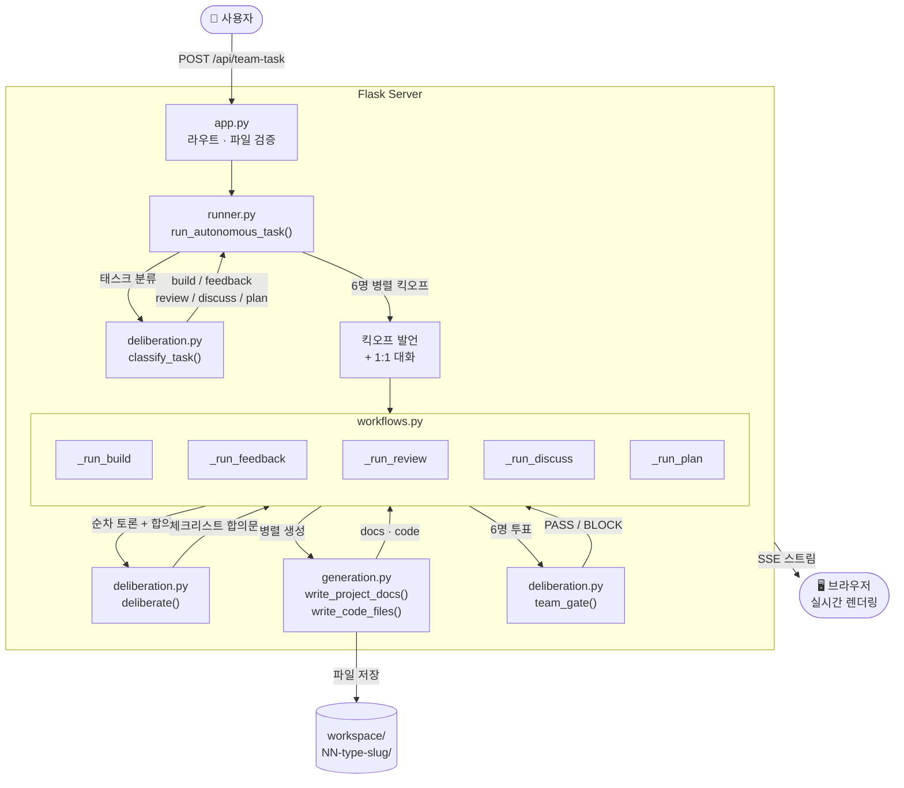
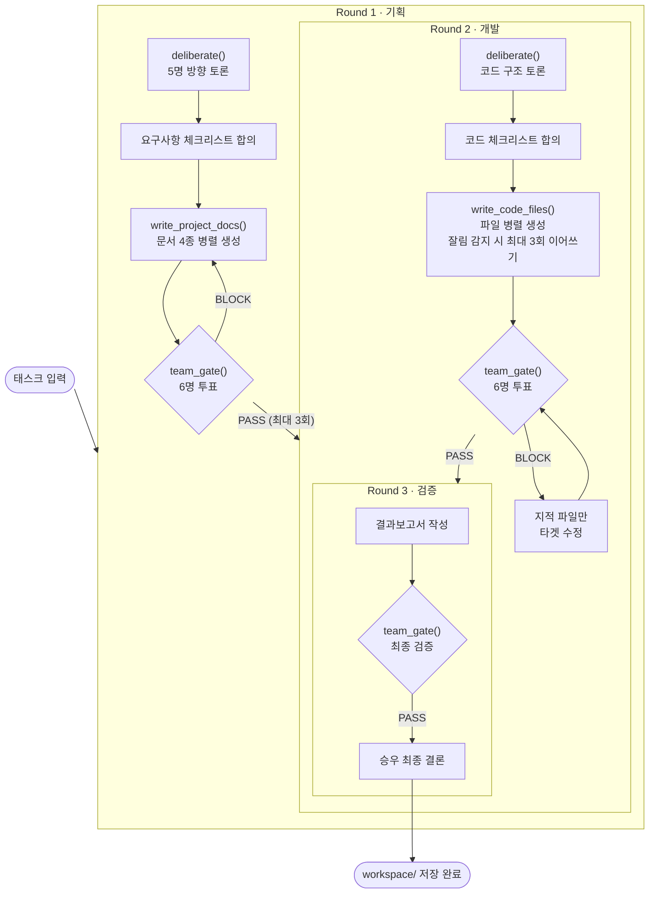

# AX Team Office

AI 에이전트 6명이 자율 협업으로 프로젝트를 기획·설계·구현하는 시뮬레이터.
태스크를 입력하면 팀원들이 토론하고, 문서와 코드를 생성한다.

---

## 시작 방법

```bash
cd ax-team
pip install flask anthropic supabase python-dotenv

# .env 파일
ANTHROPIC_API_KEY=sk-ant-...
SUPABASE_URL=https://...
SUPABASE_KEY=...

python3 app.py
# → http://localhost:5001
```

브라우저에서 `http://localhost:5001` 접속.

개발 모드(자동 재시작):
```bash
FLASK_ENV=development python3 app.py
```

---

## 팀원 구성

| 이름 | 성향 | 한 마디 |
|------|------|---------|
| 승우 | 속도파 | "일단 돌아가게 만들자" |
| 지민 | 품질파 | "검증 없이 넘어가면 나중에 두 배 더 걸려" |
| 주혁 | 혁신파 | "기존 방식 그대로는 아까워" |
| 유진 | 실용파 | "필요한 것만. 오버엔지니어링 하지 말자" |
| 수영 | 아키텍처파 | "지금 잘못 설계하면 나중에 다 갈아엎어야 해" |
| 민아 | 사용자파 | "기술적으로 완벽해도 쓰기 불편하면 소용없어" |

---

## 아키텍처

### 핵심 데이터 흐름



### 워크플로우 타입

`classify_task()`가 태스크 입력을 보고 5가지 타입 중 하나로 분류한다.

| 타입 | 라운드 | 특징 |
|------|--------|------|
| `build` | 기획→개발→검증 | team_gate 최대 3회 재시도, 실패 시 지적 파일만 타겟 수정 |
| `feedback` | 심층분석→교차토론→보고서 | 전원 개별 분석 후 deliberate |
| `review` | 전문검토→이슈토론→보고서 | CRITICAL/MAJOR/MINOR 분류 |
| `discuss` | 입장표명→다자토론→결론 | deliberate 3라운드 |
| `plan` | 방향토론→범위합의→문서작성 | write_project_docs 후 team_gate |

### SSE 이벤트 타입

모든 응답은 `utils.py:sse()`로 포맷팅된 JSON. 주요 타입:

| 이벤트 | 설명 |
|--------|------|
| `workflow` | 분류된 워크플로우 타입과 페이즈 목록 |
| `thinking` | 에이전트 로딩 표시 |
| `response` | 에이전트 발언 (`ctx`: kickoff/debate/gate/analyze/bilateral) |
| `consensus` | 팀 합의 체크리스트 |
| `gate` | team_gate 투표 결과 (`passed`, `block_reasons`) |
| `writing_doc` / `doc_saved` | 파일 생성 중/완료 |
| `round` | 현재 라운드 번호와 라벨 |
| `synthesis` / `done` | 최종 결론 및 워크플로우 완료 |

### build 워크플로우 상세



---

## 파일 구조

```
app.py              Flask 진입점 — HTTP 라우트, 파일 타입 검증
agents.py           에이전트 정의 — 성향, 시스템 프롬프트, WORKFLOW_AGENTS 설정
signals.py          제너레이터 제어 신호 타입 — ConsensusSignal, GateSignal 등
utils.py            공통 유틸 — Anthropic 클라이언트, SSE, API 래퍼, rate limit 재시도
workspace_utils.py  폴더 생성, 파일 저장, 코드 추출/잘림 감지, 경로 검증
generation.py       문서·코드 병렬 생성 (MAX_WORKERS=3)
deliberation.py     토론, 체크리스트 합의, 투표, 태스크 분류
workflows.py        타입별 실행 흐름 — 공통 헬퍼 + 5가지 워크플로우
runner.py           킥오프 → 분류 → 워크플로우 라우팅
db.py               Supabase 세션/메시지 저장 (오류 시 워크플로우 중단 없음)
rag.py              과거 유사 태스크 RAG 검색
tools.py            도구 정의 — list_files, read_file, search_memory
tests/              단위 테스트 (pytest)
migrations/         Supabase 스키마 SQL
```

### 워크스페이스 구조

태스크 실행마다 `workspace/NN-{type}-{slug}/` 폴더가 생성된다:

```
workspace/01-build-todo-app/
    docs/
        01_요구사항정의서.md
        02_기술설계서.md
        03_시장조사보고서.md
        04_진행계획서.md
        결과보고서.md
    code/
        main.py
        models.py
        ...
    static/
        index.html
    00_결론.md
```

---

## 기술 상세

### 에이전트 API 호출 구분

- `agent_call()` — 짧은 발언 (토론, 반응). 기본 150 토큰. Haiku 사용. `[NEXT: want:대상|이유]` 의도 파싱 포함.
- `doc_call()` — 문서/코드 생성. 기본 800~8192 토큰. Sonnet 사용. rate limit 시 자동 재시도.
- `tool_agent_call()` — 도구(파일 읽기/검색) 사용 가능한 ReAct 루프. 기획 첫 발언, gate 투표에 사용.

### Rate Limit 재시도

`utils.py`의 `with_rate_limit_retry()`가 모든 API 콜의 rate limit 처리를 담당한다.
exponential backoff: 1차 실패 → 15초 대기, 2차 실패 → 30초 대기, 3차 실패 → raise.

### 병렬 생성 설정 (`generation.py`)

```python
_CALL_STAGGER = 2.0   # 콜 제출 간격 (초)
_MAX_WORKERS  = 3     # 동시 최대 API 콜 수
```

rate limit 발생 시 이 값을 조정한다.

### 제너레이터 신호 패턴

워크플로우 함수들은 모두 Python generator. `signals.py`에 정의된 타입 인스턴스는
내부 제어 신호로만 사용되고 클라이언트로는 전송되지 않는다:

| 신호 | 방향 | 내용 |
|------|------|------|
| `ConsensusSignal` | deliberate → 워크플로우 | 합의문 문자열 |
| `GateSignal` | team_gate → _run_team_gate | 투표 결과 |
| `GateResultSignal` | _run_team_gate → 워크플로우 | 통과 여부 + 반려 이유 |
| `DocsSignal` | write_project_docs → 워크플로우 | 생성된 문서 dict |
| `CodeSignal` | write_code_files → 워크플로우 | 파일 플랜 + 코드 dict |
| `BriefSignal` | _collect_team_brief → generation | 팀 의견 요약 |

`str` 아이템은 클라이언트로 전송할 SSE 문자열이다.

---

## 어떻게 디벨롭했나

### v1 — CLI 스크립트 (`main.py`)

처음에는 터미널에서 태스크를 입력하면 마케팅담당·개발담당·비즈니스모델담당 3명이 순서대로 의견을 내는 단순한 CLI였다.
각자 한 번씩 발언하고 퍼실리테이터가 종합하는 구조. 실시간성도 없고, 파일도 안 만들고, 캐릭터도 없었다.

**한계:** 발언 순서가 고정이라 실제 토론처럼 느껴지지 않았다. 그리고 결과물이 텍스트 출력뿐이라 뭔가 만들어졌다는 느낌이 없었다.

---

### v2 — Flask + SSE + 치비 캐릭터

웹으로 전환. SSE(Server-Sent Events)로 에이전트 응답을 실시간 스트리밍해서 캐릭터 말풍선으로 보여줬다.
역할도 6명으로 늘리고(마케팅·개발·기획·비즈니스·데이터·팀장) 문서 4종 + 코드 파일까지 생성하도록 했다.

승우(팀장)가 단독으로 문서와 코드를 검토해서 PASS/REVISE를 판단하는 게이트키퍼 구조.

**한계:**
- 에이전트들이 각자 역할에 맞는 작업을 기계적으로 수행할 뿐, 실제로 서로 논의하거나 타협하는 과정이 없었다
- 어떤 태스크를 넣어도 무조건 문서→코드→검증 파이프라인이 실행됐다 ("피드백해줘"를 넣어도 코드를 만들어버렸다)
- 승우 혼자 게이트키퍼라서 팀 전체의 관점이 반영되지 않았다
- 역할 기반이라 캐릭터들이 개성 없이 느껴졌다

---

### v3 — 현재 구조

**역할 → 성향으로 재설계**
마케팅담당·기획담당 같은 역할 분리를 없애고, 전원 개발자로 통일했다.
대신 속도파·품질파·혁신파·실용파·아키텍처파·사용자파로 성향 차이를 두었다.
같은 주제에 대해 진짜로 부딪히게 만들기 위해서였다.

**기계적 실행 → 토론 + 합의**
`deliberate()`: 라운드 내에선 병렬로 발언하고, 라운드 간엔 이전 발언을 보고 반응한다. 마지막에 승우가 합의를 도출한다.
발언 순서가 고정된 v2와 달리, 실제로 논의가 쌓이면서 방향이 만들어지는 구조.

**승우 단독 → team_gate()**
6명이 전부 PASS/BLOCK을 투표하고, 1명이라도 BLOCK이면 통과하지 못한다.
승우만 판단하던 것보다 다양한 관점에서 결과물을 검증하게 됐다.

**고정 파이프라인 → classify_task() 라우팅**
태스크를 먼저 분류(build/feedback/review/discuss/plan)하고, 타입에 맞는 워크플로우를 실행한다.
"피드백해줘"는 분석+종합만, "만들어줘"는 3라운드 빌드, "토론해봐"는 토론+결론으로 간다.

**오피스 레이아웃 → 원탁**
역할별 개인 책상 구조를 없애고 원탁 하나로 바꿨다. 전원 개발자로 바뀐 것과 맞게.

---

### v4 — 합의 품질 개선 + 코드 강화

**합의문 구조화**
기존엔 승우(속도파)가 토론 내용을 2줄로 요약했다. 이제는 토론 후 각 에이전트가 핵심 요구사항 1가지를 직접 표명하고, 그걸 체크리스트로 합성한다.

```
기존: "빠르게 MVP를 만들고 검증하자."  ← 승우 관점만 반영

현재:
【팀 합의 체크리스트】
- 승우: 2주 안에 돌아가는 버전
- 지민: 에러 처리 및 기본 테스트 포함
- 수영: DB 스키마 먼저 확정
- 유진: 외부 라이브러리 최소화
- 주혁: AI 기능 1개 이상 포함
- 민아: 모바일 반응형 UI
```

이 체크리스트가 문서·코드 생성 프롬프트에 그대로 들어간다.

**team_gate 강화**
각 에이전트가 막연한 성향 판단 대신 **자기 요구사항이 결과물에 반영됐는지** 직접 검증한다.
1명이라도 BLOCK이면 재작성(기존: 2명). BLOCK 시 "무엇이 빠졌는지" 구체적으로 명시해 재작성 방향을 잡는다.

**보안·품질 강화**
- Path traversal 차단 (`write_workspace` 경로 검증)
- 서버 파일 타입 검증 (허용 목록 외 첨부 차단)
- `slugify_task()` API 호출 제거 → 정규식으로 대체
- `WORKFLOW_AGENTS` 설정 분리 (`agents.py`에서 관리)
- `deliberate()` history를 `deque(maxlen=20)`으로 메모리 최적화
- 환경변수 기반 debug 모드 (`FLASK_ENV=development`)

**API 최적화**
- 동시 생성 워커 2 → 3 (`_MAX_WORKERS`)
- `_CALL_STAGGER` 통일 (deliberation/generation 모두 2.0초)
- 문서 생성 max_tokens 1800 → 1500

**테스트 추가**
`tests/test_workspace_utils.py` — 핵심 순수 함수 12개 단위 테스트.

---

### v5 — 코드 구조 정리

**제너레이터 신호 타입화**
generator 간 내부 통신에 사용하던 `{"__consensus__": ...}` 같은 마법 딕셔너리 키를
`signals.py`의 dataclass 타입(`ConsensusSignal`, `GateSignal` 등)으로 교체했다.
`isinstance()` 체크가 명시적이고, 오타로 인한 묵묵한 버그 가능성이 사라진다.

**Rate limit 재시도 통합**
`doc_call()`과 `tool_agent_call()` 양쪽에 복붙되어 있던 재시도 루프를
`utils.py`의 `with_rate_limit_retry()` 하나로 통합했다.

**개인 분석 루프 추출**
`_run_feedback`, `_run_review`, `_run_discuss`에서 반복되던
"에이전트별 순차 발언 + thinking 신호 + 이전 발언 누적" 패턴을
`workflows.py`의 `_collect_individual_analysis()` 헬퍼로 추출했다.

---

## 실제 생성 사례

AX Team으로 직접 돌려본 프로젝트들. 결과물은 `workspace/` 폴더에 저장된다.

| # | 태스크 | 워크플로우 | 결과 | 주요 이슈 |
|---|--------|-----------|------|-----------|
| 01 | AI 면접 코치 | build | FastAPI + SQLite + GPT-4o 면접 질문/STAR 피드백 서비스 | import 불일치, rate limit으로 라우터 2개 생성 실패 |
| 02 | 쿠팡 가격 모니터 | build | CLI 기반 가격 추적 + 목표가 알림 도구 | agent ID 버그로 프론트 생성 실패, 5개 파일 설명 텍스트 혼입 |
| 03 | K리그 AI 해설 | feedback | 기존 AI 해설 서비스 심층 분석 및 개선 제안 | — |
| 04 | SpotMind AI B2B | build | FastAPI + PostgreSQL + Redis + React 기반 B2B SaaS | 의존성 과중 (PostgreSQL, Redis, Node.js 모두 필요) |
| 05 | 테트리스 vs AI | build | Dellacherie 휴리스틱 AI 대전 테트리스 (단일 HTML) | index.html 토큰 초과 절단, Python 파일 ` ```python ` 마커 오염 |
| 06 | 할일 앱 | build | 파일 10개짜리 to-do 앱 | 전형적인 오버엔지니어링 |

### 반복적으로 발견된 버그들과 대응

생성 사례를 쌓으면서 ax-team 코드베이스 자체를 고쳐온 기록이다.

**① 설명 텍스트 혼입** (01, 02)
에이전트가 코드 앞에 "설계 먼저 짚고 갈게요." 같은 설명을 붙이는 경우,
`extract_code()`의 정규식 매칭이 실패해 설명까지 파일에 그대로 저장됐다.
→ 마크다운 앞·뒤 텍스트를 제거하는 전처리 로직 추가.

**② 코드 잘림** (01, 02, 05)
`max_tokens` 한도 내에 파일을 다 못 쓰고 함수 중간에서 절단됐다.
에러 없이 조용히 잘려 저장 시점에 알 수 없었다.
→ `is_truncated()` 감지 패턴 강화 (`_`로 끝남, 중괄호 불균형, mid-identifier)
→ 이어쓰기 1회 → 최대 3회 루프로 변경.

**③ 병렬 생성 시 import 불일치** (01, 02)
파일 6개를 동시에 생성할 때 서로 뭘 만드는지 모른 채 독립적으로 작성돼
실제로 없는 경로나 메서드를 참조하는 코드가 만들어졌다.
→ 체크리스트 기반 합의문을 생성 프롬프트에 삽입, team_gate로 불일치 검출.

**④ agent ID 버그** (02)
민아 에이전트 ID가 코드 내에 `mina`로 잘못 등록되어 있어 생성 자체가 실패했다.
→ `agents.py`에서 ID 일관성 점검 후 수정.

**⑤ ` ```python ` 마커 오염** (05)
이어쓰기 시 새 LLM 응답이 코드 블록 마커째로 기존 파일에 붙어버렸다.
→ `extract_code()`가 이어쓰기 결과를 파싱할 때 마커 제거 처리 추가.

---

## 현재 한계

- **코드 파일 간 일관성**: 병렬 생성 시 파일들이 서로의 구조를 모르고 작성돼 import 불일치 가능. team_gate가 잡아내지만 완벽하지 않음
- **Rate Limit**: Claude API 분당 출력 토큰 한도로 병렬 생성 시 간헐적 실패 가능. 백오프 재시도 적용됨
- **코드 실행 보장 없음**: 생성된 코드는 실행 가능한 초안 수준. 실제 환경 맞춤 수정 필요
- **한글 태스크 slug**: 한글 태스크명은 workspace 폴더가 `project`로 생성됨 (영문 태스크 권장)
